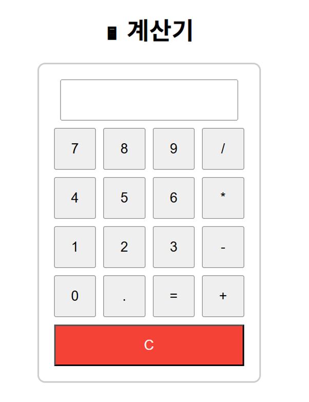

# 📱 Calculator App

간단한 사칙연산 기능을 제공하는 계산기 애플리케이션입니다.

## 📌 주요 기능
- 덧셈, 뺄셈, 곱셈, 나눗셈
- 실시간 연산 결과 표시
- 클리어(초기화) 기능

## 📦 기술 스택
- Python 3.x
- Tkinter (GUI 인터페이스용)
- 기타 사용 라이브러리 (필요시 추가)

## 📂 프로젝트 구조
calculator.app/
├── main.py # 실행 파일
├── calculator.py # 계산기 기능 구현 파일
├── README.md # 프로젝트 설명서

## 📌 실행 방법
1. Python 3.x 설치
2. 프로젝트 폴더로 이동
3. 아래 명령어 실행

## 📸 실행 화면

